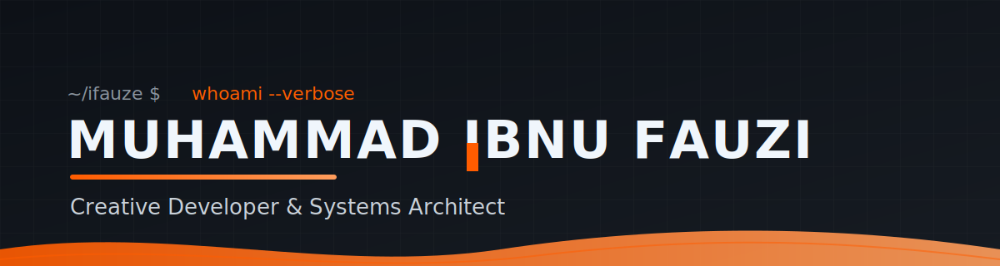

<!--
  ╔══════════════════════════════════════════════════════════════════════════╗
  ║  OPERATOR'S LOG — Muhammad Ibnu Fauzi · building from packets → neural nets
  ╚══════════════════════════════════════════════════════════════════════════╝
-->

<p align="center">
  
</p>

<p align="center">
  <a href="https://ifauzeee.vercel.app"></a>
  <a href="https://www.linkedin.com/in/muhammad-ibnu-fauzi-66842a2a7"></a>
  <a href="https://t.me/ifauzeee"></a>
  <a href="mailto:ifauze343@gmail.com"></a>
</p>

<p align="center">
  
</p>

<p align="center">
  
  
  
  
</p>

---

## 👤 About Me

<table>
  <tr>
    <td width="62%" valign="top">

**Muhammad Ibnu Fauzi** — mahasiswa **Teknik Multimedia & Jaringan**, Politeknik Negeri Jakarta.  
I operate where **web**, **desktop**, **IoT**, and **AI/ML** meet.

> *"The best technology works silently in the background — but leaves a real impact.  
> I build systems that survive: from UDP packets to inference pipelines."*

- 🔭 Building **self-hosted platforms**, **Edge-AI** pipelines & **realtime** systems
- 🌱 Exploring **computer vision**, **low-level networking** & **distributed systems**
- 🧩 I enjoy reverse-engineering messy problems into clean, maintainable architecture
- ⚡ Fun fact: my projects span a **Telegram bot in Go**, a **waste-bin with a brain**, and a **hi-res audio desktop app**

</td>
<td width="38%" valign="top">

**📌 Now**
```
$ whoami --verbose
role     : Student / Builder
focus    : Edge AI · Realtime · Self-host
stack    : TS · Go · Next.js · Flutter
editor   : Neovim / VS Code
os       : Windows + WSL2 + Linux
```
**🎯 Goals 2026**
- Ship more **production-grade** self-hosted tools
- Deepen **Edge AI / CV** on resource-limited hardware
- Contribute to **open-source** developer tooling

</td>
  </tr>
</table>

---

## 🛠️ What I Build

<div align="center">

| Domain | What it looks like |
| :--- | :--- |
| **🌐 Web & Cloud** | Next.js apps, REST/WebSocket APIs, admin dashboards, CMS, streaming platforms |
| **🖥️ Desktop** | Cross-platform Electron apps with native workflows & local-first storage |
| **📡 IoT & Edge** | ESP32 / Raspberry Pi firmware, UDP/serial protocols, on-device AI inference |
| **🤖 Bots & Automation** | Telegram bots (Go), task orchestration, media processing pipelines |
| **🗄️ Data & Infra** | PostgreSQL / MySQL / SQLite, Redis caching, Docker, CI/CD, monitoring |

</div>

---

## 🧰 Tech Stack

<div align="center">


<br/>


</div>

---

## 🚀 Featured Projects

<table>
  <tr>
    <td width="50%" valign="top">

### 🗂️ [Zee-Index](https://github.com/ifauzeee/Zee-Index)
*Self-Hosted Google Drive Explorer · CMS · Streaming Platform*

Turn Google Drive into a pro file manager + media streamer with virtualized rendering, RBAC, 2FA, share links & TMDB metadata.

`Next.js 16` · `React 19` · `TypeScript` · `PostgreSQL` · `Redis` · `Docker`

</td>
<td width="50%" valign="top">

### 🤖 [Zee-Mirror](https://github.com/ifauzeee/Zee-Mirror)
*High-Performance Telegram Mirror & Leech Bot*

Go binary powering mirror/leech, torrents, yt-dlp & cloud clone across 40+ providers — with a live React dashboard.

`Go 1.25` · `React` · `aria2` · `rclone` · `yt-dlp` · `SQLite` · `Docker`

</td>
  </tr>
  <tr>
    <td width="50%" valign="top">

### 🗑️ [VisioBIN](https://github.com/ifauzeee/VisioBIN)
*Edge-AI Smart Waste Management System*

YOLOv8 waste classification on Raspberry Pi + ESP32 sensors, with a Go API, Next.js dashboard & Flutter app.

`Go` · `Next.js` · `Flutter` · `Edge AI` · `IoT` · `PostgreSQL`

</td>
<td width="50%" valign="top">

### 🎵 [QBZ-Downloader](https://github.com/ifauzeee/QBZ-Downloader)
*Hi-Res Audio Downloader & Library Manager*

Cross-platform desktop app for studio-quality FLAC (24-bit/192kHz), synced lyrics, smart tagging & analytics.

`Electron` · `React` · `TypeScript` · `SQLite` · `Vite`

</td>
  </tr>
  <tr>
    <td width="50%" valign="top">

### 🚌 [BIPOL Tracker](https://github.com/ifauzeee/bipol)
*Real-Time Campus Bus Tracking System*

Node.js + WebSocket + UDP IoT (ESP32/SIM808) live bus map, geofencing, gas alerts & PWA admin/driver panels.

`Node.js` · `Express` · `Socket.io` · `PWA` · `IoT` · `Supabase`

</td>
<td width="50%" valign="top">

### 🛒 [Smart POS](https://github.com/ifauzeee/Point-of-Sale)
*Modern Web Point of Sale*

Full-stack POS with offline mode, multi-role auth, inventory, analytics & receipt printing.

`React` · `Vite` · `Node.js` · `Express` · `MySQL` · `PWA`

</td>
  </tr>
  <tr>
    <td width="50%" valign="top">

### 🎬 [Movie Stream App](https://github.com/ifauzeee/movie-stream-app)
*Self-Hosted Movie Streaming*

Next.js 16 movie catalog & player with admin panel and Prisma-backed metadata storage.

`Next.js 16` · `React 19` · `Prisma` · `libSQL` · `TypeScript`

</td>
<td width="50%" valign="top">

### ✂️ [Zee-Cut (Android)](https://github.com/ifauzeee/Zee-Cut)
*WiFi Network Device Controller*

Root Android app that scans & controls devices on your own network via a custom NDK ARP-spoof binary.

`Kotlin` · `C/NDK` · `Android` · `Networking`

</td>
  </tr>
  <tr>
    <td width="50%" valign="top">

### 🌐 [Portofolio](https://github.com/ifauzeee/Portofolio)
*OPERATOR'S LOG — Personal Site*

Hand-built, animated portfolio (GSAP/Lenis) showcasing the projects above. Live at **[ifauzeee.vercel.app](https://ifauzeee.vercel.app)**.

`HTML5` · `CSS3` · `JavaScript` · `GSAP` · `Lenis`

</td>
<td width="50%" valign="top">

### 📦 More on [GitHub](https://github.com/ifauzeee?tab=repositories)
*Always shipping*

Explore the rest of my repositories, experiments & utilities — new tools land regularly.

`Open Source` · `Tooling` · `Experiments`

</td>
  </tr>
</table>

---

## 📊 GitHub Analytics

<p align="center">
  
  
</p>

<p align="center">
  
  
</p>

<p align="center">
  
</p>

---

## 🐍 Contribution Snake

<p align="center">
  
</p>

---

## 🤝 Let's Collaborate

<div align="center">

I'm always open to **freelance**, **open-source**, and **research** collaborations — especially around  
**self-hosted tooling**, **Edge AI / CV**, and **realtime systems**.

[](https://github.com/ifauzeee)
[](https://www.linkedin.com/in/muhammad-ibnu-fauzi-66842a2a7)
[](https://t.me/ifauzeee)
[](mailto:ifauze343@gmail.com)
[](https://ifauzeee.vercel.app)

</div>

---

<div align="center">

<sub>⚡ <em>OPERATOR'S LOG — built by hand, not by prompt.</em></sub><br/>
<sub>© 2026 Muhammad Ibnu Fauzi · Made with ☕ & curiosity</sub>

</div>

